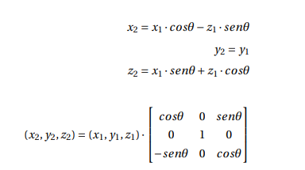
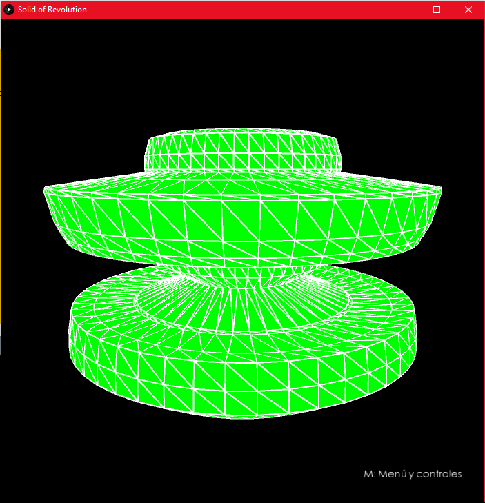
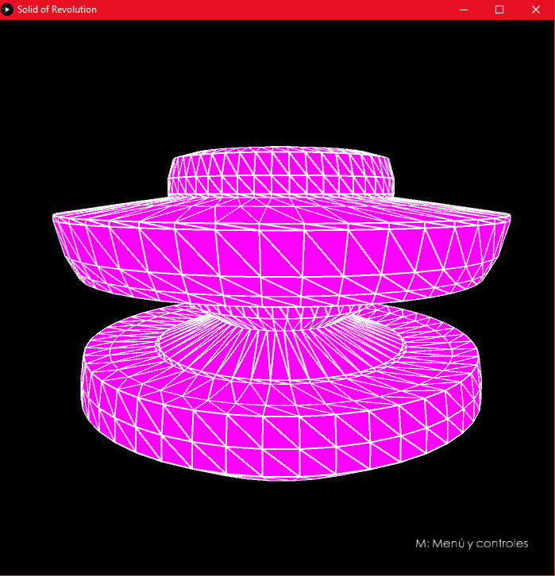
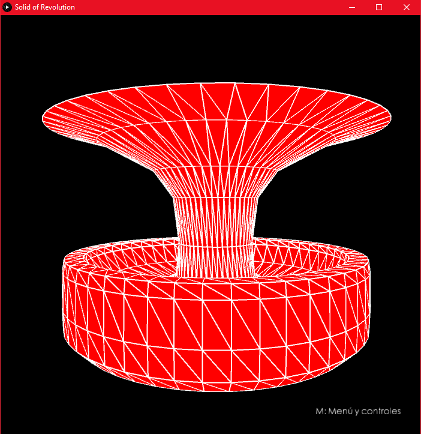
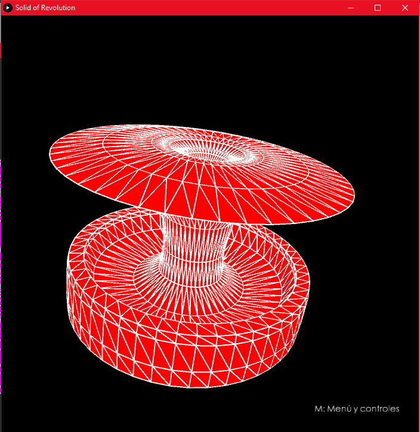
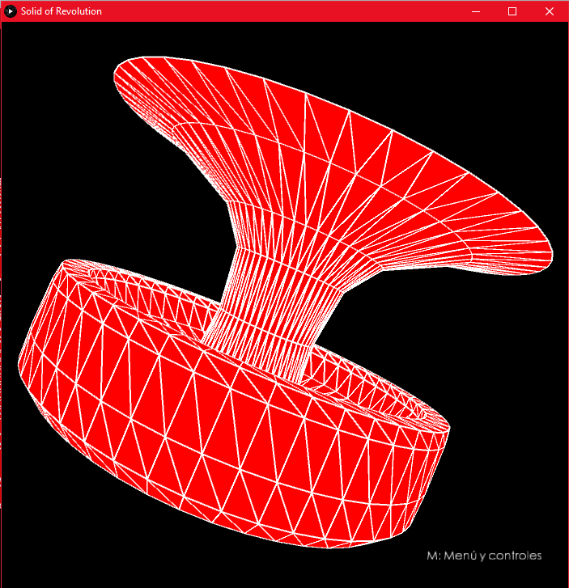
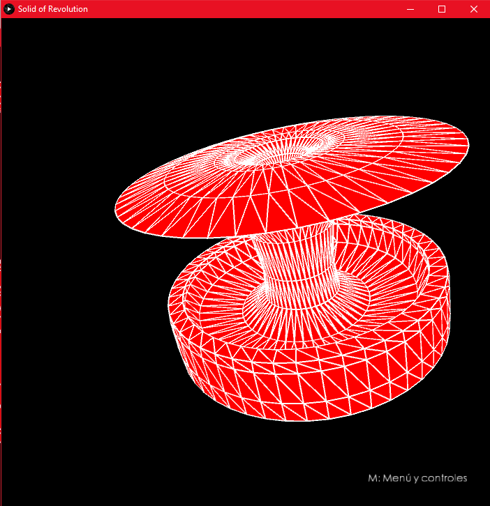
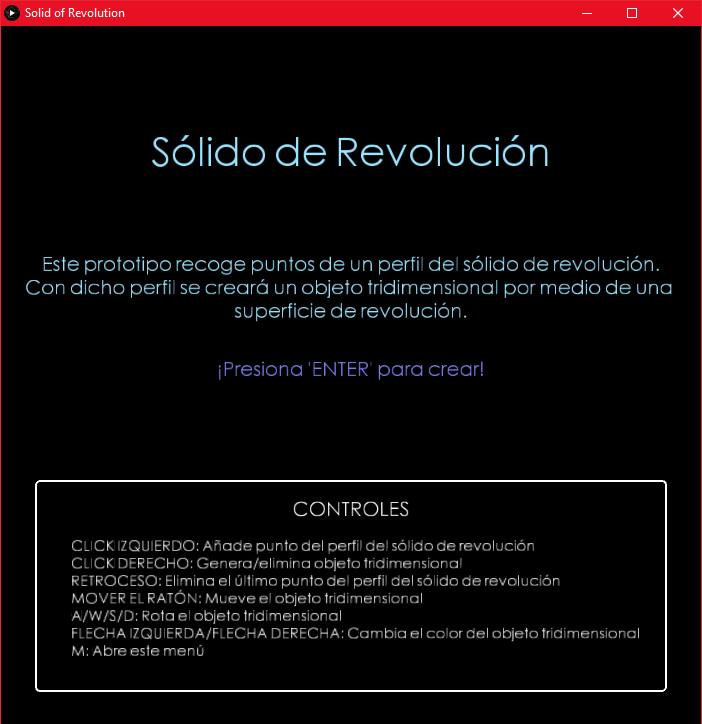
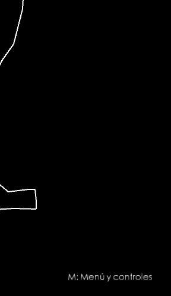

# Práctica 2 - Modelo de Sólido de Revolución


## Memoria

### Autor

Kevin David Rosales Santana - <kevin.rosales101@alu.ulpgc.es>

### Índice

1. [Introducción](#1-introducción)
2. [Muestra del resultado](#2-muestra-del-resultado)
3. [Descripción del trabajo realizado](#3-descripción-del-trabajo-realizado)

   3.1 [Estructura de ficheros](#31-estructura-de-ficheros)
   
   3.2 [Decisiones en el desarrollo](#32-decisiones-en-el-desarrollo)
   
      - 3.2.1 [Generación del Modelo 3D](#321-generación-del-modelo-3d)
      
      - 3.2.2 [Colores](#322-colores)
      
      - 3.2.3 [Rotación](#323-rotación)
      
      - 3.2.4 [Suprimir el último punto del perfil](#324-suprimir-el-último-punto-del-perfil)
      
      - 3.2.5 [Menú](#325-menú) 
   
4. [Conclusión](#4-conclusión)
5. [Ejecución del Proyecto](#5-ejecución-del-proyecto)
6. [Referencias y herramientas utilizadas](#6-referencias-y-herramientas-utilizadas)

### 1. Introducción

En la presente práctica se pedía implementar un **Generador de Modelos 3D de Sólidos de Revolución**, sirviendo para el aprendizaje de *Processing*, el cual tiene como objetivo facilitar los desarrollos con fines creativos en entornos digitales. 

Dicho prototipo debe recoger puntos de un **perfil del sólido de revolución** al hacer click izquierdo con el ratón sobre la ventana. Dicho perfil es utilizado para crear un **objeto 3D por medio de una superficie de revolución**, almacenando la geometría resultante en una variable tipo *PShape*. 

Por tanto, en este repositorio se tiene una implementación que incluye:

- **Generación de sólidos de revolución de forma sucesiva**. 
  - El modelo generado se mueve junto al ratón del usuario.
  - Al pulsar **click derecho** tras generar el modelo 3D, se puede volver a generar otro.
- [Aportación Propia] Cambio de **color** del objeto 3D.
- [Aportación Propia] **Rotación** del objeto 3D.
- [Aportación Propia] Capacidad para **eliminar el último punto del perfil** del sólido de revolución.
- [Aportación Propia] **Menú**.

### 2. Muestra del resultado

<div align="center">
   </img>
   <p>Figura 1: Muestra del resultado</p>
</div>

### 3. Descripción del trabajo realizado

#### 3.1 Estructura de ficheros

Para realizar este trabajo, se han creado estos cinco ficheros (presentes en la carpeta [Practica2](Practica2/)):

| Fichero          | Descripción                                                  |
| :--------------- | :----------------------------------------------------------- |
| *Practica2.pde*  | Fichero encargado de la **interfaz gráfica** del generador. Además, al ser el fichero principal, gestiona el `setup()` y el `draw()` del proyecto haciendo uso del resto de ficheros del este. Por último, incluye los gestores de eventos del teclado y del ratón. |
| *Controller.pde* | Clase **controlador**. Se encarga de gestionar los nuevos puntos del perfil, de generar el sólido de revolución con el *PShape* del Modelo 3D, de administrar la limpieza del perfil o del último punto de este y de manejar el cambio de color y la rotación del sólido de revolución. |
| *Model2D.pde*    | Clase **modelo** que representa a un objeto *Modelo 2D*. Dicho objeto contiene la lista de puntos usados para generar el Modelo 3D. |
| *Model3D.pde*    | Clase **modelo** que representa a un objeto *Modelo 3D*. Dicho objeto contiene el *PShape* utilizado para representar el sólido de revolución. |
| *Point.pde*      | Clase **modelo** que representa a un objeto *punto* con precisión *float*. |

<div align="center">
   <p>Tabla 1: Estructura de ficheros</p>
</div>

#### 3.2 Decisiones en el desarrollo

A la hora de realizar el **sólido de revolución** se ha tenido que tomar una serie de decisiones respecto al desarrollo del proyecto. A continuación, se listarán dichas decisiones:

##### 3.2.1 Generación del Modelo 3D

A la hora de generar el sólido de revolución, se recogen los puntos que el usuario ha introducido previamente para formar **un perfil del sólido de revolución.** A continuación, utilizando *PShape* con *TRIANGLE_STRIP*, se va formando **el modelo 3D con los triángulos de dichos puntos. **

Cada triángulo se forma gracias a que los puntos del perfil del sólido de revolución se **rotan** usando las siguientes fórmulas (recogidas de [indicaciones de la práctica (referencia 1)](#6-referencias-y-herramientas-utilizadas)):

<div align="center">
   </img>
   <p>Figura 2: Fórmulas de Rotación</p>
</div>

Teniendo en cuenta que los puntos originalmente en el perfil del sólido de revolución carecen de profundidad (`z1 = 0`) y que las coordenadas originales se sitúan en la mitad derecha del generador (con lo que es necesario situarlo alrededor `x=0` restándole `width/2`), el código generador de los vértices resulta de esta manera:

```java
  void fillVertex(){
    PShape sor = model3d.getSor();
    ArrayList<Point> points = model2d.getPoints();
    float theta = 0;
    float PX, PX1, PZ1, PX2, PZ2;
    for(int i = 0; i < points.size()-1; i++){
      
      while(theta <= TWO_PI + 0.1){
        PX = (points.get(i).getX()-width/2);
        PX1 = PX * cos(theta);
        PZ1 = PX * sin(theta);
        
        PX = (points.get(i+1).getX()-width/2);
        PX2 = PX * cos(theta);
        PZ2 = PX * sin(theta);
        
        theta += dtheta;
        sor.vertex(PX1, points.get(i).getY(), PZ1);
        sor.vertex(PX2, points.get(i+1).getY(), PZ2);
      }
      theta = 0;
    }
    sor.endShape();
  }
```

<div align="center">
   <p> Fragmento de Código 1: Generación del Modelo 3D con PShape</p>
</div>

La razón por la que la condición del `while` es `theta <= TWO_PI + 0.1` es debido a que se deben tratar los **360º**. Al tratarse de triángulos, es necesario un pequeño solapamiento (`+ 0.1`) para evitar que el modelo 3D resultante contenga algún hueco vacío. El incremental `dtheta` definirá el número de triángulos finales (se entrega el proyecto con `dtheta = 2*PI/100`).

La parte imprescindible de la generación del modelo 3D es que los puntos **deben estar intercalados** para que, mediante la técnica de *TRIANGLE_STRIP* se puedan formar correctamente los triángulos.

##### 3.2.2 Colores

Como aportación propia, se le permite al usuario que cambie el **color del Modelo 3D** . Para ello, tan solo debe (como el menú informa) pulsar **las flechas izquierda y derecha del teclado** (← y →) cuando genere el modelo.

|                 Modelo de color verde                 |                 Modelo de color violeta                 |
| :---------------------------------------------------: | :-----------------------------------------------------: |
|  |  |

<div align="center">
   <p> Tabla 2: Colores en el Modelo 3D</p>
</div>

Para lograr este cambio de color, se almacena en una matriz `colors` el RGB de 7 colores (ver fichero [Model3D.pde](Practica2/Model3D.pde)). Tras ello, se cambia el color haciendo uso de `setFill(color(R,G,B))`

##### 3.2.3 Rotación

Para implementar la rotación, se ha hecho uso del mismo sistema de gestión de eventos de teclado que se usó para el [*Pong*](https://github.com/kevinrosalesdev/CIU-Practica1/). Es decir, mediante unas variables de estado del modelo 3D (`isUpPressed`, `isDownPressed`, `isLeftPressed`, `isRightPressed`) se gestiona cómo se quiere realizar la rotación. 

La rotación se realiza usando el método `rotateX(angle)` y `rotateY(angle)`:

```java
  void rotate3dModel(){
    PShape sor = model3d.getSor();
    if (model3d.isDownPressed) sor.rotateX(0.01);
    if (model3d.isUpPressed) sor.rotateX(-0.01);
    
    if (model3d.isLeftPressed) sor.rotateY(0.01);
    if (model3d.isRightPressed) sor.rotateY(-0.01);
  }
```

<div align="center">
    <p> Fragmento de Código 2: Rotación del Modelo 3D con <i>PShape</i></p>
</div>

Así pues, pulsando (como el menú informa) las teclas `A`, `W`, `S` y  `D` se puede rotar el modelo:

|                    Fase A                     |                    Fase B                     |                    Fase C                     |                    Fase D                     |
| :-------------------------------------------: | :-------------------------------------------: | :-------------------------------------------: | :-------------------------------------------: |
|  |  |  |  |

<div align="center">
   <p> Tabla 3: Rotaciones en el Modelo 3D</p>
</div>

Se debe tener en cuenta que para que el modelo 3D, al ser creado, siga de forma apropiada al ratón y al **ser rotado no supere en exceso los límites de la ventana**, se ha tenido que programar un `translate` tal que: `translate(mouseX, mouseY-500, -250)`.

##### 3.2.4 Suprimir el último punto del perfil

Para favorecer al principio de **Jakob Nielsen** *Control y libertad del usuario*, se le da la posibilidad al usuario de pulsar la tecla *Retroceso* para **eliminar el último punto** que ha insertado en el perfil del sólido de revolución.

##### 3.2.5 Menú

Se ha desarrollado un menú previo al generador que introduce a los usuarios al sistema y les informa sobre sus **controles**:

<div align="center">
   </img>
   <p>Figura 3: Menú</p>
</div>

Para realizar este menú, se han seguido las indicaciones de la [referencia de Processing (Referencia 2)](#6-referencias-y-herramientas-utilizadas). Por ello, se realiza un `noLoop()` al ejecutar el `setup()`, evitando que se ejecute en bucle el `draw()`.  Además, se dibuja el menú que se puede observar en la *Figura 3*.

Al pulsar `ENTER`, se llama a `loop()` (reanudando el bucle del `draw()`) y se desactiva el "Modo menú" que no permitía acceder al contenido del `draw()`. 

**Nota importante**: Para pulsar `ENTER`, la ventana de este debe estar *focuseada*.

La idea de que los controles no aparezcan siempre a la hora de hacer el perfil del sólido de revolución **es no llenar al usuario de información por pantalla.** Por ello, si quiere volver a ver **los controles** si tiene cualquier duda **tan solo debe pulsar 'M'** como se ve en la siguiente imagen:

<div align="center">
   </img>
   <p>Figura 4: Opción de volver a visualizar el menú y los controles</p>
</div>

**Los procesos realizados tras ir al menú y volver no se pierden.**

### 4. Conclusión

Esta práctica ha servido como aprendizaje para *Processing* y, además, se ha tratado de una práctica muy entretenida donde se ha tenido contacto con una herramienta que permite facilitar el tipo de desarrollos similares al visto en este proyecto.

Además, realizar este tipo de trabajos da una idea lo pragmáticas que resultan este tipo de técnicas para desarrollar **modelos 3D**.

Por último, se debe recalcar que gracias a esta segunda práctica de *Creando Interfaces de Usuario*, se ha podido **estudiar el manejo del *PShape***, incluyendo su generación, movimiento o, en este caso, **rotación**.

### 5. Ejecución del proyecto

Para ejecutar este proyecto, es necesario:

- Tener instalado [Processing (Referencia 3)](#6-referencias-y-herramientas-utilizadas)

Para ejecutar el proyecto, tan solo se debe abrir el fichero [Practica2.pde](Practica2/Practica2.pde) y darle al botón de ejecutar.

### 6. Referencias y herramientas utilizadas

- [1] Modesto Fernando Castrillón Santana, José Daniel Hernández Sosa. [Creando Interfaces de Usuario. Guion de Prácticas](https://cv-aep.ulpgc.es/cv/ulpgctp20/pluginfile.php/126724/mod_resource/content/22/CIU_Pr_cticas.pdf)
- [2] Processing Foundation. [Processing Reference.](https://processing.org/reference/)
- [3] Processing Foundation. [Processing Download.](https://processing.org/download/)
- [4] Extrapixel. [GifAnimation Processing Library.](https://github.com/extrapixel/gif-animation)